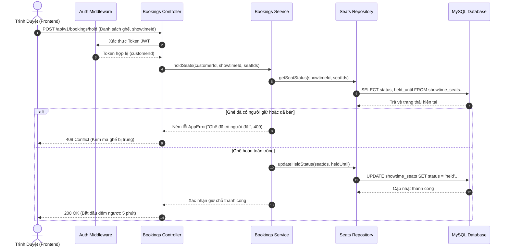

# CINE-VUE BACK-END: HỆ THỐNG DỊCH VỤ VÀ XỬ LÝ NGHIỆP VỤ RẠP CHIẾU PHIM
> *Hệ thống API RESTful hiệu năng cao, xây dựng theo kiến trúc Module-Based Architecture trên nền tảng Node.js, Express và MySQL.*

---

## 1. TỔNG QUAN HỆ THỐNG (EXECUTIVE SUMMARY)

### Mục tiêu thiết kế
Trong bài toán thương mại điện tử ngành rạp chiếu phim, hệ thống Backend đóng vai trò then chốt trong việc bảo đảm tính toàn vẹn dữ liệu, kiểm soát tranh chấp tài nguyên (Concurrency / Race Condition khi nhiều người cùng chọn một ghế), và bảo mật thông tin khách hàng cũng như giao dịch thanh toán.

**Cine-Vue Backend** được thiết kế đáp ứng các tiêu chuẩn:
* **High Availability & Low Latency:** Tối ưu hóa truy vấn cơ sở dữ liệu qua MySQL Connection Pool và Prepared Statements.
* **Module-Based Architecture:** Phân tách hệ thống thành các module nghiệp vụ độc lập, giúp việc bảo trì, kiểm thử và mở rộng quy mô (Scale-up) đạt hiệu quả tối đa.
* **Robust Concurrency Control:** Cơ chế giữ chỗ tạm thời (Seat Holding) có thời gian hết hạn (`held_until`) đi kèm worker dọn dẹp nền tự động.
* **Zero-Crash Strategy:** Cơ chế xử lý ngoại lệ tập trung (Centralized Global Error Handling) ngăn chặn tình trạng sập server ngoài ý muốn và chuẩn hóa định dạng JSON phản hồi.

---

## 2. NỀN TẢNG CÔNG NGHỆ VÀ BẢO MẬT (TECH STACK & SECURITY)

Hệ thống sử dụng các công nghệ tiêu chuẩn trong hệ sinh thái Node.js doanh nghiệp:

| Thành phần | Công nghệ | Vai trò & Giải pháp mang lại |
| :--- | :--- | :--- |
| **Runtime Environment** | Node.js (LTS) | Xử lý I/O phi đồng bộ (Asynchronous Non-blocking I/O) tối ưu cho lưu lượng request cao. |
| **Web Framework** | Express.js 4.x | Bộ khung định tuyến RESTful API gọn nhẹ, linh hoạt với hệ thống Middlewares phân tầng. |
| **Database Engine** | MySQL 8.x | Hệ quản trị cơ sở dữ liệu quan hệ bảo đảm toàn vẹn giao dịch (ACID compliance). |
| **Database Driver** | `mysql2/promise` | Trình điều khiển kết nối MySQL hỗ trợ Promise/Async-Await, Connection Pool và Prepared Statements chống SQL Injection. |
| **Authentication** | `jsonwebtoken` (JWT) | Xác thực không trạng thái (Stateless Authentication) qua access token, an toàn và dễ mở rộng. |
| **Password Hashing** | `bcryptjs` | Mã hóa mật khẩu một chiều sử dụng muối ngẫu nhiên (Salt rounds = 10) chống tấn công Rainbow Table. |
| **Data Validation** | `joi` | Kiểm tra chặt chẽ cấu trúc, kiểu dữ liệu và định dạng của Request Body/Params trước khi vào Controller. |
| **Security Headers** | `helmet` | Tự động thiết lập các HTTP headers bảo mật (chống XSS, Clickjacking, MIME-sniffing). |
| **Traffic Control** | `express-rate-limit` | Giới hạn tần suất gọi API trên mỗi địa chỉ IP, ngăn chặn tấn công Brute-force và DoS cơ bản. |
| **Media Storage** | `multer` + `cloudinary` | Tiếp nhận file tải lên trong bộ nhớ đệm và đẩy trực tiếp lên Cloudinary CDN. |

---

## 3. KIẾN TRÚC PHẦN MỀM (ARCHITECTURAL DEEP-DIVE)

### 3.1. Mô hình Module-Based Architecture (Kiến trúc theo tính năng)
Hệ thống không gom tất cả Controller hay Model vào một thư mục dùng chung, mà phân chia theo từng nghiệp vụ độc lập trong `src/modules/`. Mỗi module là một đơn vị khép kín tuân thủ mô hình 4 tầng (Layered Pattern):

```text
Request ---> [Route] ---> [Middleware / Validator] ---> [Controller] ---> [Service] ---> [Repository] ---> [MySQL DB]
                                                                              |
                                                                   (Ném lỗi AppError)
                                                                              v
Response <------------------------------------------------------- [Global Error Handler]
```

1. **Tầng Route (`*.routes.js`):** Định nghĩa endpoints, gán middleware xác thực (`authMiddleware`), phân quyền (`roleMiddleware`) và kiểm tra dữ liệu (`validateMiddleware`).
2. **Tầng Controller (`*.controller.js`):** Tiếp nhận request, trích xuất dữ liệu, điều phối gọi Service và trả về response chuẩn hóa thông qua helper `apiResponse`.
3. **Tầng Service (`*.service.js`):** Trái tim của hệ sinh thái backend, chứa toàn bộ Business Logic, tính toán giá vé, kiểm tra quyền, tạo token và chủ động ném ngoại lệ `AppError`.
4. **Tầng Repository (`*.repository.js`):** Tầng duy nhất được phép giao tiếp với MySQL. Chứa các câu lệnh SQL thuần được tối ưu chỉ mục (Index) và bảo vệ tham số binding (`undefined -> null`).

### 3.2. Cơ chế xử lý lỗi tập trung (Global Error Handling)
Mọi lỗi phát sinh trong luồng xử lý không bị bắt thủ công bằng `try/catch` dàn trải, mà được ném ra qua lớp đối tượng chuẩn:
```javascript
throw new AppError("Email hoặc mật khẩu không chính xác", 401);
```
Middleware `error-handler.js` tại tầng `shared` sẽ tự động bắt lấy lỗi này, ghi log hệ thống và xuất ra client cấu trúc JSON thống nhất:
```json
{
  "success": false,
  "statusCode": 401,
  "message": "Email hoặc mật khẩu không chính xác"
}
```

---

## 4. CHI TIẾT CÁC MODULE NGHIỆP VỤ (MODULES BREAKDOWN)

Hệ thống được chia thành 14 module chức năng chính:

1. **`auth`:** Đăng ký tài khoản, đăng nhập, mã hóa mật khẩu, cấp phát JWT token mang theo role (`admin` / `customer`).
2. **`customers`:** Quản lý thông tin hồ sơ người dùng (họ tên, email, số điện thoại, ngày sinh, ảnh đại diện).
3. **`movies`:** Quản lý thông tin phim (tên, đạo diễn, diễn viên, thời lượng, trailer, phân loại độ tuổi, trạng thái đang chiếu/sắp chiếu).
4. **`showtimes`:** Quản lý lịch chiếu theo ngày, phòng chiếu và cụm rạp; cung cấp dữ liệu lịch chiếu realtime cho frontend.
5. **`rooms`:** Quản lý danh sách phòng chiếu thuộc từng rạp (phòng Standard, IMAX, 3D).
6. **`seats`:** Quản lý sơ đồ ghế vật lý của từng phòng chiếu; định nghĩa loại ghế (ghế Thường, VIP, Đôi) và tọa độ hàng/cột.
7. **`bookings`:** Quản lý phiên đặt vé, liên kết người dùng với suất chiếu và danh sách ghế đã chọn.
8. **`tickets`:** Quản lý vé xem phim thực tế được xuất sau khi thanh toán, tạo mã vé điện tử.
9. **`combos`:** Quản lý danh mục bắp nước, combo đồ ăn kèm bán kèm theo đơn vé.
10. **`promotions`:** Quản lý mã giảm giá, voucher khuyến mãi, thời hạn áp dụng và điều kiện chiết khấu.
11. **`payments`:** Xử lý xác nhận thanh toán, lưu vết lịch sử giao dịch và tích hợp cổng thanh toán.
12. **`cinemas`:** Quản lý thông tin rạp chiếu (địa chỉ, số hotline, định vị bản đồ).
13. **`brands`:** Quản lý thương hiệu chuỗi rạp.
14. **`cities`:** Quản lý danh mục tỉnh/thành phố để phục vụ bộ lọc tìm rạp theo khu vực.

---

## 5. CƠ CHẾ QUẢN LÝ GHẾ VÀ GIỮ CHỖ (SEAT HOLDING ENGINE)

### Vấn đề giải quyết
Khi hai khách hàng cùng truy cập một suất chiếu và cùng bấm chọn ghế A1 tại cùng một thời điểm, hệ thống cần bảo đảm chỉ có một người được giữ ghế và người còn lại phải nhận thông báo ghế không khả dụng.

### Quy trình kiểm soát trạng thái ghế:
1. **Khởi tạo:** Mọi ghế trong suất chiếu mặc định ở trạng thái `available`.
2. **Giữ ghế (Hold):** Khi người dùng chọn ghế, trạng thái chuyển thành `held`, đồng thời gán mốc thời gian hết hạn (`held_until = NOW() + 5 phút`).
3. **Thanh toán thành công:** Ghế chuyển sang trạng thái `booked` vĩnh viễn và tạo bản ghi trong bảng `tickets`.
4. **Hết thời gian giữ chỗ (Auto-Release Worker):** Script nền `scripts/expire-held-seats.js` quét định kỳ qua câu lệnh tối ưu:
```sql
UPDATE showtime_seats 
SET status = 'available', held_until = NULL 
WHERE status = 'held' AND held_until <= NOW();
```
Điều này bảo đảm ghế không bao giờ bị khóa chết nếu người dùng đột ngột đóng trình duyệt hoặc hủy thanh toán.

---

## 6. SƠ ĐỒ TUẦN TỰ ĐẶT VÉ (BOOKING SEQUENCE FLOW)



---

## 7. CẤU TRÚC MÃ NGUỒN (SOURCE CODE ORGANIZATION)

```text
backend/
├── bin/
│   └── www                     # Entry point khởi tạo HTTP server qua http.createServer
├── scripts/
│   └── expire-held-seats.js     # Worker giải phóng ghế hết hạn giữ chỗ
├── sql/
│   ├── lean_ticketing_schema.mysql.sql # File DDL khởi tạo toàn bộ bảng và quan hệ
│   ├── update_showtimes.sql     # Script cập nhật và chèn dữ liệu suất chiếu mẫu
│   └── lean_schema_notes.md     # Tài liệu diễn giải cấu trúc thực thể CSDL
├── src/
│   ├── modules/                # 14 module tính năng độc lập (Routes, Controller, Service, Repo)
│   ├── routes/
│   │   └── index.js            # Điểm tập hợp toàn bộ routes của các module vào tiền tố /api
│   └── shared/
│       ├── config/             # Cấu hình kết nối MySQL Pool, Cloudinary SDK
│       ├── middleware/         # Middlewares: auth, role, error-handler, validate, upload
│       └── utils/              # Lớp AppError và helper chuẩn hóa phản hồi JSON
├── app.js                      # Cấu hình Express app, gắn Cors, Helmet, RateLimit, Parser
├── package.json                # Danh mục thư viện và scripts quản thi
└── .env.example                # Bản mẫu khai báo biến môi trường chuẩn
```

---

## 8. QUY CHUẨN KỸ THUẬT & AN TOÀN DỮ LIỆU (STANDARDS & BEST PRACTICES)

1. **Phòng chống tấn công SQL Injection:**
   * Nghiêm cấm hoàn toàn việc nối chuỗi câu lệnh SQL (`"SELECT * FROM users WHERE id = " + id`).
   * 100% câu lệnh truy vấn đều sử dụng tham số đánh dấu hỏi chấm (`?`) của MySQL Prepared Statements.
2. **Khắc phục lỗi Undefined trong MySQL2:**
   * Driver `mysql2` mặc định sẽ ném lỗi crash nếu mảng bind parameters chứa giá trị `undefined`.
   * Mọi trường dữ liệu không bắt buộc (như `date_of_birth`, `avatar_url`) đều được ép kiểu an toàn: `val === undefined ? null : val`.
3. **Kiểm soát tính hợp lệ ngay từ cửa vào:**
   * Mọi request thay đổi dữ liệu (POST, PUT, PATCH) bắt buộc phải đi qua middleware `validate(schema)` sử dụng Joi trước khi chạm tới Controller.
4. **Bảo mật phân quyền theo vai trò (RBAC):**
   * Các endpoint nhạy cảm (thêm phim, tạo suất chiếu, xem doanh thu) bắt buộc phải qua middleware `roleMiddleware("admin")`.

---

## 9. HƯỚNG DẪN CÀI ĐẶT VÀ VẬN HÀNH (GETTING STARTED)

### Yêu cầu môi trường
* **Node.js:** Phiên bản `>= 18.x`
* **MySQL Server:** Phiên bản `>= 8.0`

### 1. Cài đặt các gói phụ thuộc
```bash
cd backend
yarn install
# hoặc npm install
```

### 2. Thiết lập Biến môi trường (.env)
Tạo file `.env` tại thư mục gốc `backend/` dựa trên mẫu `.env.example`:
```env
PORT=3000
NODE_ENV=development

# Cấu hình Cơ sở dữ liệu MySQL
DB_HOST=localhost
DB_USER=root
DB_PASSWORD=your_password
DB_NAME=cine_vue_db
DB_PORT=3306

# Cấu hình Bảo mật JWT
JWT_SECRET=your_super_secret_jwt_key_here
JWT_EXPIRES_IN=1h

# Cấu hình Cloudinary (Lưu trữ ảnh)
CLOUDINARY_CLOUD_NAME=your_cloud_name
CLOUDINARY_API_KEY=your_api_key
CLOUDINARY_API_SECRET=your_api_secret
```

### 3. Khởi tạo Cơ sở dữ liệu
Chạy file SQL trong thư mục `sql/` trên MySQL Workbench hoặc CLI:
```bash
mysql -u root -p cine_vue_db < sql/lean_ticketing_schema.mysql.sql
```

### 4. Khởi chạy hệ thống

**Chế độ phát triển (Development với Nodemon tự động reload):**
```bash
yarn dev
```

**Chế độ chính thức (Production):**
```bash
yarn start
```

**Chạy worker giải phóng ghế quá hạn:**
```bash
yarn expire-holds
```

---
*Dự án Backend được thiết kế bảo đảm tính ổn định cao, bảo vệ dữ liệu toàn vẹn và sẵn sàng kết nối tích hợp liền mạch với Cine-Vue Frontend.*
