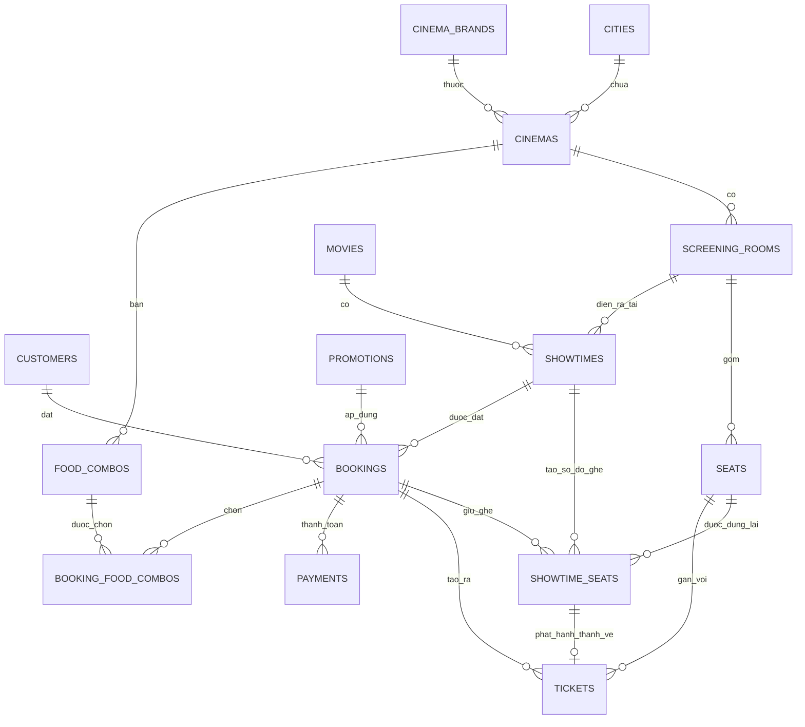

# Giới thiệu database

File schema chính:

```text
lean_ticketing_schema.mysql.sql
```

Đây là database tinh gọn cho một hệ thống đặt vé xem phim có hỗ trợ:

- nhiều thương hiệu rạp
- nhiều cụm rạp và phòng chiếu
- quản lý ghế theo từng suất chiếu
- đặt vé
- thanh toán
- mã khuyến mãi
- chọn combo đồ ăn theo từng rạp

Mục tiêu của thiết kế này là giữ database **gọn, dễ hiểu, không chứa bảng dư thừa**, nhưng vẫn đủ để phát triển thành một sản phẩm đặt vé thực tế.

---

# Sơ đồ quan hệ tổng quan



---

# Các nhóm bảng chính

## 1. Người dùng

### `customers`

Lưu thông tin tài khoản khách hàng và tài khoản quản trị.

Các cột đáng chú ý:

- `email`, `phone`: duy nhất
- `password_hash`: mật khẩu đã được mã hóa
- `avatar_url`: ảnh đại diện, có giá trị mặc định
- `role`: `customer` hoặc `admin`
- `status`: `active` hoặc `blocked`

---

## 2. Cấu trúc rạp chiếu

### `cities`

Lưu danh sách thành phố.

### `cinema_brands`

Lưu các thương hiệu rạp, ví dụ:

- CGV
- Lotte
- Galaxy

Có thể lưu thêm `logo_url` để hiển thị logo thương hiệu.

### `cinemas`

Lưu từng cụm rạp cụ thể.

Mỗi rạp:

- thuộc về một `cinema_brand`
- nằm trong một `city`

### `screening_rooms`

Lưu các phòng chiếu trong từng rạp.

Ví dụ:

- Room 1
- Room IMAX
- Room 4DX

### `seats`

Lưu sơ đồ ghế cố định của từng phòng.

Ví dụ:

- A1
- A2
- B3

Các loại ghế:

- `standard`
- `vip`
- `couple`

---

## 3. Phim và suất chiếu

### `movies`

Lưu thông tin phim:

- tên phim
- slug
- thời lượng
- thể loại
- độ tuổi
- poster / banner / trailer
- trạng thái đang chiếu hay sắp chiếu

### `showtimes`

Lưu từng suất chiếu cụ thể của một phim trong một phòng chiếu.

Một suất chiếu có:

- giờ bắt đầu
- giờ kết thúc
- giá ghế thường
- giá ghế VIP
- giá ghế đôi

### `showtime_seats`

Đây là một trong những bảng quan trọng nhất của hệ thống.

Nó thể hiện **trạng thái của từng ghế trong từng suất chiếu**:

- `available`
- `held`
- `booked`

Lý do cần bảng này:

- cùng một ghế A1 có thể trống ở suất 19:00
- nhưng đã được đặt ở suất 21:00

Nếu chỉ dùng bảng `seats`, hệ thống sẽ không thể quản lý đúng việc đặt ghế theo từng suất.

---

## 4. Đặt vé

### `bookings`

Lưu đơn đặt vé tổng.

Một booking gắn với:

- một khách hàng
- một suất chiếu
- có thể có một mã khuyến mãi

Các cột tiền:

- `subtotal_amount`: tổng tiền trước giảm giá
- `discount_amount`: số tiền được giảm
- `final_amount`: số tiền cần thanh toán

Các trạng thái:

- `pending`
- `confirmed`
- `cancelled`
- `completed`

### `tickets`

Lưu từng vé thực tế sau khi booking được xác nhận.

Mỗi ticket gắn với:

- một booking
- một `showtime_seat`
- một ghế cụ thể

---

## 5. Khuyến mãi

### `promotions`

Lưu mã khuyến mãi.

Hỗ trợ:

- giảm theo phần trăm
- giảm số tiền cố định
- giá trị đơn tối thiểu
- mức giảm tối đa
- khoảng thời gian hiệu lực

Trong thiết kế hiện tại:

- một booking có thể gắn tối đa một promotion thông qua `bookings.promotion_id`

---

## 6. Thanh toán

### `payments`

Lưu các lần thanh toán của booking.

Bao gồm:

- số tiền
- phương thức thanh toán
- trạng thái
- mã giao dịch
- thời điểm thanh toán

`transaction_id` được đặt unique để tránh lưu trùng cùng một giao dịch.

---

## 7. Combo đồ ăn

### `food_combos`

Lưu danh sách combo đồ ăn của từng rạp.

Ví dụ:

- Combo Solo
- Combo Couple
- Combo Premium

Mỗi rạp có thể:

- bán combo khác nhau
- đặt giá khác nhau

### `booking_food_combos`

Lưu các combo mà khách chọn trong từng booking.

Bao gồm:

- số lượng
- đơn giá tại thời điểm đặt
- thành tiền

Việc lưu `unit_price` và `line_total` tại đây giúp dữ liệu booking không bị thay đổi nếu giá combo sau này đổi.

---

# Luồng nghiệp vụ chính

## 1. Khách chọn suất chiếu

1. Chọn phim
2. Chọn rạp
3. Chọn phòng / suất chiếu
4. Hệ thống đọc danh sách ghế từ `showtime_seats`

## 2. Khách chọn ghế

1. Ghế đang trống có trạng thái `available`
2. Khi khách bắt đầu đặt, hệ thống có thể chuyển ghế sang `held`
3. Sau khi thanh toán thành công, ghế chuyển sang `booked`

## 3. Khách chọn combo đồ ăn

1. Hệ thống lấy combo từ `food_combos` theo `cinema_id`
2. Các combo khách chọn được lưu vào `booking_food_combos`

## 4. Áp dụng mã khuyến mãi

1. Kiểm tra mã trong `promotions`
2. Gắn promotion vào `bookings.promotion_id`
3. Tính lại:
   - `subtotal_amount`
   - `discount_amount`
   - `final_amount`

## 5. Thanh toán

1. Tạo bản ghi trong `payments`
2. Nếu thanh toán thành công:
   - booking chuyển sang `confirmed`
   - ghế chuyển sang `booked`
   - tạo `tickets`

---

# Một số nguyên tắc thiết kế đang được áp dụng

- Dùng khóa ngoại để bảo vệ quan hệ dữ liệu
- Dùng unique key cho các dữ liệu cần duy nhất:
  - email
  - phone
  - slug phim
  - ghế trong từng phòng
  - ghế trong từng suất chiếu
  - transaction id thanh toán
- Dùng `CHECK` để ngăn dữ liệu sai:
  - thời gian kết thúc phải sau thời gian bắt đầu
  - giá tiền không âm
  - số lượng combo phải lớn hơn 0
- Dùng `created_at` và `updated_at` cho các bảng có vòng đời cập nhật rõ ràng

---

# Kết luận

Schema này phù hợp cho một hệ thống đặt vé xem phim có quy mô vừa, cần:

- cấu trúc rõ ràng
- không dư bảng
- dễ hiểu
- đủ an toàn dữ liệu
- vẫn còn đường mở rộng sau này nếu hệ thống phát triển thêm
