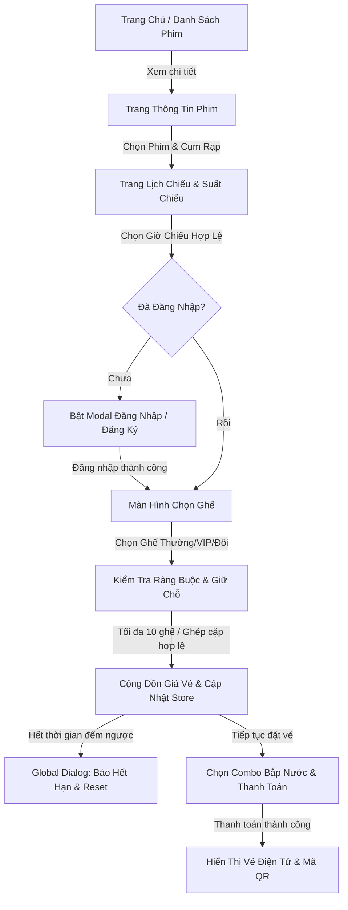

# CINE-VUE FRONT-END: HỆ THỐNG ĐẶT VÉ XEM PHIM TRỰC TUYẾN THẾ HỆ MỚI
> *Một nền tảng web đặt vé xem phim hiện đại, tối ưu trải nghiệm thị giác và quy trình tương tác người dùng, được xây dựng trên nền tảng Vue 3 & Modern Web Stack.*

---

## 1. TỔNG QUAN DỰ ÁN (EXECUTIVE SUMMARY)

### Tầm nhìn & Vấn đề giải quyết
Trong thời đại số hóa ngành giải trí, người dùng đòi hỏi một nền tảng mua vé xem phim không chỉ nhanh chóng mà còn phải đem lại cảm xúc điện ảnh ngay từ giây đầu tiên truy cập. Nhiều nền tảng hiện nay gặp phải các hạn chế: giao diện phân mảnh, quy trình giữ ghế thiếu trực quan, xử lý lỗi kém thân thiện (dùng alert mặc định làm đứt quãng trải nghiệm), và mất trạng thái giao dịch khi tải lại trang.

**Cine-Vue** ra đời nhằm định hình lại trải nghiệm đặt vé xem phim:
* **Minimalist Aesthetics (DaisyUI Lofi Theme):** Giao diện theo trường phái tối giản (Minimalism), đường nét tinh gọn, độ tương phản cao, giúp người dùng tập trung tuyệt đối vào nội dung phim và thao tác đặt vé nhanh chóng.
* **Seamless Flow:** Quy trình giữ ghế - chọn combo - xác nhận vé liền mạch, chống thất lạc dữ liệu (persistence state).
* **Robust Feedback:** Hệ thống thông báo đa tầng (Toast Notification & Confirmation Modal) thay thế hoàn toàn các popup native gián đoạn của trình duyệt.

---

## 2. ĐIỂM SÁNG CÔNG NGHỆ & KIẾN TRÚC (TECH STACK SHOWCASE)

Dự án áp dụng các tiêu chuẩn phát triển phần mềm hiện đại nhất trong hệ sinh thái Vue.js:

| Công nghệ | Vai trò & Giá trị mang lại |
| :--- | :--- |
| **Vue 3 (Composition API)** | Cú pháp `<script setup>` tối ưu hiệu năng render, tách biệt triệt để Logic (Composables) và Giao diện (Template). |
| **Vite** | Máy chủ phát triển thế hệ mới với HMR (Hot Module Replacement) dưới 100ms, tối ưu hóa bundle khi đóng gói sản phẩm. |
| **Pinia State Store** | Kiến trúc module hóa store (`auth`, `booking`, `movie`, `app`), kiểu dữ liệu an toàn, dễ bảo trì và mở rộng. |
| **Tailwind CSS & DaisyUI 5** | Định hình phong cách thiết kế với theme `lofi` tối giản, thanh lịch, kết hợp tiện ích responsive và hệ thống component chuẩn mực. |
| **Vue Router 4** | Quản lý điều hướng động, tích hợp Navigation Guards bảo vệ tuyến đường yêu cầu xác thực. |
| **Swiper.js** | Hiệu ứng băng chuyền phim (Poster Slider) và bộ chọn ngày (Date Swiper) mượt mà trên mọi kích thước màn hình. |
| **Axios Interceptor** | Quản lý vòng đời yêu cầu HTTP, tự động gán Bearer Token và đồng bộ trạng thái kết nối máy chủ. |

---

## 3. CÁC TÍNH NĂNG TRỌNG TÂM (FEATURE DEEP-DIVE)

### 3.1. Xác thực người dùng thông minh (Smart Authentication Modal)
* **Trải nghiệm Popup không điều hướng:** Người dùng có thể đăng nhập/đăng ký ở bất kỳ trang nào mà không bị chuyển trang gây đứt đoạn cảm xúc.
* **Validation thời gian thực (Realtime Input Validation):** 
  * Tích hợp kho biểu thức chính quy tập trung (`utils/constants/regex.js`).
  * Kiểm tra chặt chẽ: Định dạng Họ & Tên tiếng Việt có dấu, Số điện thoại nhà mạng Việt Nam (`03, 05, 07, 08, 09`), Mật khẩu tối thiểu 8 ký tự.
* **Inline Error Feedback:** Lỗi được hiển thị trực tiếp dưới chân ô nhập và cảnh báo lỗi đăng nhập màu đỏ ngay trên modal, nói không với popup che khuất màn hình.

### 3.2. Khám phá Phim & Lịch chiếu động (Showtime & Movie Discovery)
* **Phân loại phim:** Phim đang chiếu (Now Showing), Phim sắp chiếu (Coming Soon) với bộ lọc thời gian thực.
* **Bộ chọn ngày thông minh (BaseTimeSwiper):** Tự động phát hiện ngày hôm nay, tính toán chuẩn múi giờ địa phương (`getTimezoneOffset`), khóa hiển thị các suất chiếu trong quá khứ tránh đặt nhầm.

### 3.3. Sơ đồ chọn ghế ma trận tương tác (Interactive Seat Map)
* **Đa dạng loại ghế:** Xử lý linh hoạt ma trận ghế Thường (Single), ghế VIP và **Ghế đôi (Couple Seat)**.
* **Thuật toán ghép cặp ghế đôi:** Tự động phát hiện và chọn/hủy đồng bộ theo cặp liền kề hợp lệ, không cho phép chọn lẻ một nửa ghế đôi.
* **Ràng buộc an toàn:** Giới hạn tối đa 10 ghế/lần đặt nhằm ngăn chặn tình trạng đầu cơ vé.

### 3.4. Hệ thống Giữ chỗ & Chống gián đoạn (Session Resilience)
* **Bảo toàn dữ liệu (Storage Persistence):** Sử dụng cơ chế lưu trữ localStorage có định thời (`storage.js`), người dùng vô tình bấm F5 vẫn giữ nguyên trạng thái ghế đang chọn.
* **Điều hướng bảo vệ (Stale Guard):** Nếu người dùng copy link đặt vé sang tab ẩn danh hoặc máy khác mà không có dữ liệu phiên, hệ thống sẽ tự động kích hoạt Modal thông báo và chuyển hướng an toàn về trang chọn suất chiếu.
* **Bộ đếm thời gian giữ ghế:** Đếm ngược thời gian thanh toán thời gian thực; tự động hủy phiên và giải phóng ghế khi hết giờ.

### 3.5. Hệ thống Thông báo Đa tầng (Multi-tier Notification System)
* **Tầng 1 - Global Toast (Thông báo nổi):** 
  * Dành cho các phản hồi tức thì: *"Đăng nhập thành công"*, *"Đã lưu giỏ hàng"*, *"Chọn tối đa 10 ghế"*.
  * Neo tại góc trên bên phải, tự động biến mất sau 3 giây với hiệu ứng trượt Slide mượt mà.
* **Tầng 2 - Global Dialog Modal (Hộp thoại xác nhận):** 
  * Dành cho các tình huống mang tính chất quyết định: *"Hết thời gian giữ ghế"*, *"Phiên giao dịch không hợp lệ"*.
  * Khóa màn hình, bắt buộc người dùng tương tác nút "Đồng ý" để thực thi hành động điều hướng.

---

## 4. HÀNH TRÌNH NGƯỜI DÙNG (USER JOURNEY FLOW)



---

## 5. KIẾN TRÚC MÃ NGUỒN (SOURCE CODE ORGANIZATION)

```text
frontend/src/
├── _services/            # Tầng HTTP: Khởi tạo Axios client, cấu hình interceptors
├── assets/               # Tài nguyên: CSS tokens, hình ảnh thương hiệu, icon hệ thống
├── components/           
│   ├── common/           # Khối tái sử dụng cao (BaseIcon, BaseLoading, Swiper wrappers)
│   ├── features/client/  # Khối nghiệp vụ rạp chiếu (MovieTicket, SeatGrid, Card...)
│   └── layout/           # Bố cục giao diện (Header, Footer, GlobalToast, GlobalDialog)
├── composables/          # Hook logic trừu tượng (useSeatMap.js...)
├── layouts/              # Master layouts phân cấp trang (ClientLayout.vue)
├── router/               # Định tuyến SPA, cấu hình Guards kiểm soát quyền truy cập
├── stores/               # Quản lý State phân tầng theo nghiệp vụ:
│   ├── app/              # ToastStore, DialogStore, ServerConnectionStore
│   ├── auth/             # AuthStore (JWT Token, User Profile, Session)
│   └── booking/          # BookingStore, SeatStore, PaymentStore
├── utils/                
│   ├── constants/        # Hằng số toàn cục (regex.js, paymentData.js, Banner.js)
│   └── helpers/          # Hàm tiện ích (storage.js lưu dữ liệu có TTL, formatters)
├── views/client/         # Các View tương ứng từng trang đích trên URL
├── App.vue               # Root View: Neo giữ Global Toast, Global Dialog & Loading Screen
└── main.js               # Điểm khởi động: Đăng ký Pinia, Router và Plugins
```

---

## 6. QUY CHUẨN PHÁT TRIỂN & TỐI ƯU HÓA (BEST PRACTICES)

1. **Nguyên tắc DRY (Don't Repeat Yourself):** 
   * Mọi mã kiểm tra biểu thức chính quy (Email, SĐT, Tên) được tập trung tại `utils/constants/regex.js`.
   * Mọi logic gọi thông báo được thu gọn thành 1 dòng code: `toastStore.success(...)` hoặc `dialogStore.alert(...)`.
2. **Component Độc lập & Khép kín:** 
   * Tên component tuân theo chuẩn **Multi-word PascalCase** (`RegisterModal.vue`, `BaseTimeSwiper.vue`).
   * Phân tách mạch lạc giữa component trình bày (Presentational Component) và component vùng chứa logic (Container Component).
3. **Quản lý Bộ nhớ & Tránh Memory Leak:** 
   * Mọi bộ hẹn giờ (`setTimeout`, `setInterval`) trong các store hoặc countdown đều được dọn dẹp khi unmount hoặc khi hoàn thành tiến trình.

---

## 7. HƯỚNG DẪN CÀI ĐẶT & CHẠY THỬ (GETTING STARTED)

### Yêu cầu tiên quyết
* **Node.js:** Phiên bản `>= 18.x`
* **Package Manager:** `yarn` (khuyến nghị) hoặc `npm`

### Các bước khởi chạy
```bash
# 1. Di chuyển vào thư mục frontend
cd frontend

# 2. Cài đặt các gói phụ thuộc
yarn install

# 3. Khởi chạy máy chủ phát triển (Development Server)
yarn dev
```
> Ứng dụng sẽ sẵn sàng tại địa chỉ: **`http://localhost:5173`**

### Đóng gói cho môi trường Production
```bash
yarn build
```

---

## 8. ĐỊNH HƯỚNG PHÁT TRIỂN (FUTURE ROADMAP)
* [ ] Tích hợp WebSocket (Socket.io) để đồng bộ trạng thái ghế theo thời gian thực giữa nhiều người dùng cùng lúc.
* [ ] Mở rộng cổng thanh toán quét mã QR (VNPAY, MoMo, ZaloPay Sandbox).
* [ ] Ứng dụng PWA (Progressive Web App) cho phép lưu vé và xem offline trên thiết bị di động.

---
*Dự án được xây dựng với tinh thần cẩn trọng, chỉn chu và hướng tới trải nghiệm người dùng tối ưu nhất.*
